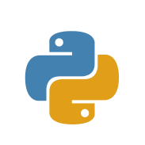
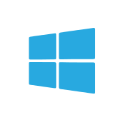
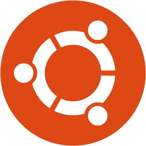
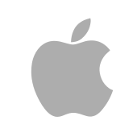

### Hi there, I'm Stephan 👋

## I'm a Student in Sports Technology!

- 🔭 I am currently working on my Masterthesis on Computer Vision!
- 🌱 I’m combining my love for Sports and Technology 🤣
- 👯 I’m looking to collaborate with other developers
- 🥅 2021 Goals: Finish my Masterthesis and apply to Jobs in Computer Vision.
- ⚡ Fun fact: I love to play chess and soccer.

### Languages and Tools:

[]
[]
[]
[]
[]
[]
[]
[]
[]
[]
[]
[]
[]

---
